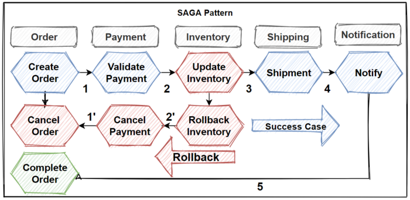

```
Node version v20.11.1
Run with yarn
```


## Saga pattern


[!] Currently, I haven't implement the retry mechanism for failed message publishing becuz
there is no datasource to store the failed ones. 

## Testing
Full test: `yarn test`

By flow: `yarn test -t "[flow name]"` or just using the Jest Runner extension


